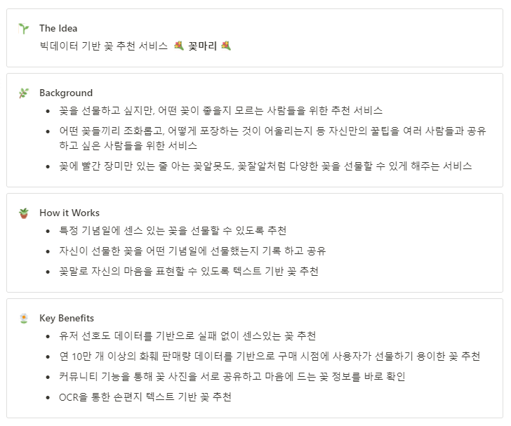

# 🌼꽃마리🌼

> 판매량과 사용자 취향 기반 빅데이터 꽃 추천 플랫폼

 

## 😀 Team
|||||||
|:---:|:---:|:---:|:---:|:---:|:---:|
|문요성|박영준|전윤선|이지수|정윤영|지용현|
|FrontEnd|FrontEnd|FrontEnd|BackEnd|BackEnd|BackEnd|

 

## 📃 Docs

* [Notion](https://www.notion.so/a303-princess/97e776287f304c1f8492d1f622f448c7)
* [Figma](https://www.figma.com/file/acI0amdouM8jI9ORIoJ9mN/%EA%BD%83%EB%A7%88%EB%A6%AC)
* [Convention Rules](https://lab.ssafy.com/s07-bigdata-recom-sub2/S07P22A303/-/wikis/home)

 

## [🛠기술 스택](https://lab.ssafy.com/s07-bigdata-recom-sub2/S07P22A303/-/wikis/Tech-Stack)

#### Communication Tool
> 
> 
> 
> 

#### Development Tool
> 
> 
> 
> 

#### FrontEnd
> 
> 
> 
> 
> 
> 
> 

#### BackEnd
> 
> 
> 
> 
> 

#### Server
> 
> 
> 
> 
> 
> 

 
 

## 기획

 

## 산출물
#### FrontEnd
* [컬러 팔레트](https://a303-princess.notion.site/14e449ed16df45bdb14f1fe2ada16a7f)
* [목업](https://a303-princess.notion.site/06a4abbe99d74367a5fa378fc93141f2)
* [화면 정의서](https://a303-princess.notion.site/398602bed88147449753419eb72f7a14)

#### BackEnd
* [ERD](https://a303-princess.notion.site/ERD-be88f33cce064721b42a9dd400019212)
* [기능 명세서](https://a303-princess.notion.site/4b620507610246b2a9392f11f2f7c112)
* [API 명세서](https://a303-princess.notion.site/API-9dbdb091f79041c69ca38d5af22e0713)
* [시퀀스 다이어그램](https://a303-princess.notion.site/9338f8c41f744ff6b44d0b5462a2db81)
* [아키텍처](https://a303-princess.notion.site/70356a7ef26d430ab943792b4e5d1a76)

